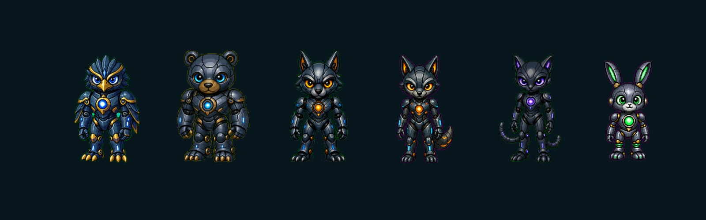

# macOS Hermes Agent Pets



Native macOS desktop companions for Hermes Agent.

The public starter set includes Koda, Miko, Bramble, Nyx, Pip, and Atlas: small humanoid robot animal companions that react to `/pet` commands, Hermes tool activity, stop-sign warnings, deletion confirmations, and agent state changes. Personal/private characters are intentionally not included in this public repo.

The companion roster is centralized in `hermes-agent-pets/companions.json`. The installable Hermes plugin lives in `hermes-agent-pets/hermes-pet-agent`.

## Quick Start

Fast install from a terminal:

```bash
curl -fsSL https://raw.githubusercontent.com/fenner888/hermes-agent-pets-macos/main/install.sh | bash
```

Restart Hermes after installing the plugin, then run:

```text
/pet wake
/pet companions
/pet companion koda
/pet companion miko
/pet companion bramble
/pet companion nyx
/pet companion pip
/pet companion atlas
```

## Choosing a Pet

Inside Hermes, use `/pet companions` to see the available starter companions and
which one is active:

```text
/pet companions
```

Switch to any included companion with `/pet companion <id>`:

```text
/pet companion koda
/pet companion miko
/pet companion bramble
/pet companion nyx
/pet companion pip
/pet companion atlas
```

Check the current active pet and state with:

```text
/pet status
```

The current release uses Hermes commands for listing and selecting pets. It does
not include a Codex-style visual pet picker yet.

Manual install from a cloned repo:

```bash
scripts/validate-hermes-pet.py character-sets/koda
scripts/validate-hermes-companions.py
scripts/hermes-pet-overlay/build.sh
scripts/hermes-pet-doctor --build
scripts/install-hermes-agent-pet.sh
```

Audio-reactive dancing is optional and off by default:

```text
/pet dance on
/pet dance off
```

## Requirements

- macOS
- Hermes with local plugin support
- Xcode Command Line Tools, for `clang`
- Python 3.10 or newer

## Project Layout

```text
character-sets/
  koda/                   reusable Koda character source
  miko/                   reusable Miko character source
  bramble/                reusable Bramble character source
  nyx/                    reusable Nyx character source
  pip/                    reusable Pip character source
  atlas/                  reusable Atlas character source
hermes-agent-pets/
  hermes-pet-agent/       installable Hermes plugin package
  companions.json         centralized companion roster and state model
  placeholders/           traceable placeholder art for future companions
  reference-art/          concept-art manifest and imported source images
scripts/
  hermes-pet-overlay/     native macOS overlay source and build script
  validate-hermes-pet.py  character package validator
  validate-hermes-companions.py companion roster validator
  preview-hermes-pet.py   static HTML character preview generator
  package-hermes-pet.py   promotes a character into a plugin package
  hermes-pet-doctor       release readiness checks
  test-hermes-agent-pet.py runtime regression checks
```

Generated work belongs in ignored folders such as `hatch-runs/`, `build/`, and `.venv/`. Final release assets should be promoted into `character-sets/` and `hermes-agent-pets/hermes-pet-agent/assets/`.

## Character Workflow

Validate a character set:

```bash
scripts/validate-hermes-pet.py character-sets/koda
```

Generate a browser preview:

```bash
scripts/preview-hermes-pet.py character-sets/koda --output /tmp/koda-preview.html
```

Promote a character into the Hermes plugin package:

```bash
scripts/package-hermes-pet.py --character character-sets/koda --plugin hermes-agent-pets/hermes-pet-agent --asset-id koda
```

Run release checks:

```bash
scripts/hermes-pet-doctor --build
scripts/test-hermes-agent-pet.py
scripts/smoke-install.sh
```

To include a native overlay launch in the smoke rehearsal:

```bash
scripts/smoke-install.sh --overlay
```

## Install Rehearsal

Use a temp plugin directory before touching a real Hermes install:

```bash
HERMES_PLUGIN_DIR=/tmp/hermes-plugin-test scripts/install-hermes-agent-pet.sh
scripts/test-hermes-agent-pet.py --plugin /tmp/hermes-plugin-test/hermes-pet-agent
```

The plugin installs to:

```text
~/.hermes/plugins/hermes-pet-agent
```

## Public Character Policy

This repo should only contain public starter companions, tooling, and docs. Personal character assets, private mascot names, local machine paths, and one-off generated frame folders should stay out of Git.

For custom pet creation, see `CUSTOM_PETS.md`.

## Community

- `CONTRIBUTING.md`: contribution workflow and validation expectations.
- `SECURITY.md`: how to report security-sensitive issues.
- `CODE_OF_CONDUCT.md`: project conduct expectations.
- `.github/ISSUE_TEMPLATE/`: issue templates for bugs, features, and custom pet proposals.

## License

This project is released under the MIT License. Unless noted otherwise, the license covers the code, docs, bundled starter companion metadata, and bundled starter companion assets in this repo.

The public starter companions are intended as reusable examples for Hermes Agent Pets. Users can create and package their own companions without using a private/personal character from this repo.
